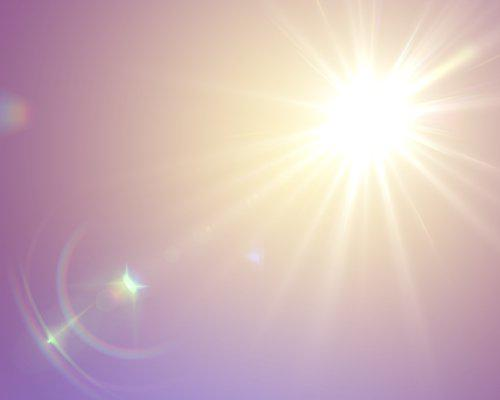

## Glare detection

Detection of glare effect in images using transfer learning from VGG19 pretrained on ImageNet.

Examples of images with glare and without it:

(Based on: https://www.pyimagesearch.com/2019/05/20/transfer-learning-with-keras-and-deep-learning/)
